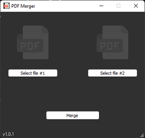
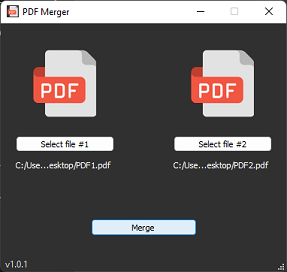

# PDF Merger

Application that merges two PDFs documents into a single file.

Completly open source and built with PyPDF2 and PyQT5.

## Usage

Run the `.exe` file if you are on Windows or run the Python script. The application will open in the main and only screen:

Click on "Select file #1" button and a prompt will open. Select the first PDF file (the one that will appear first on the final document).

The PDF icon will light up. Repeat the last step for file #2.

When both files are selected, click on the button "Merge". You will be prompted to choose the save location and the application will create the new file for you.

## Windows executable

Go to the [latest release](https://github.com/vinyluis/PDF_Merger/releases/latest)  and download the `.exe` file.

The executable was built using pyinstaller, and you can build it yourself from the file `main.py`, if you want.

## Python

**Requirements**:
- PyPDF2 = 2.8.1
- PyQt5 = 5.15.7

Clone this repository or donwload the code.

Open your preferred IDE and run the file main.py, or run this file on the command prompt.

The interface will open, and you can refer to "***Usage***" on how to use the application.

---
---
## Versions

### v1.0

#### v1.0.1 (28/07/22)
- Included images and icons
- Created first executable

#### v1.0.0 (27/07/22)
- Initial version. 
- Still missing some images, but the merger works if you run it in Python. 
- No executable available yet.